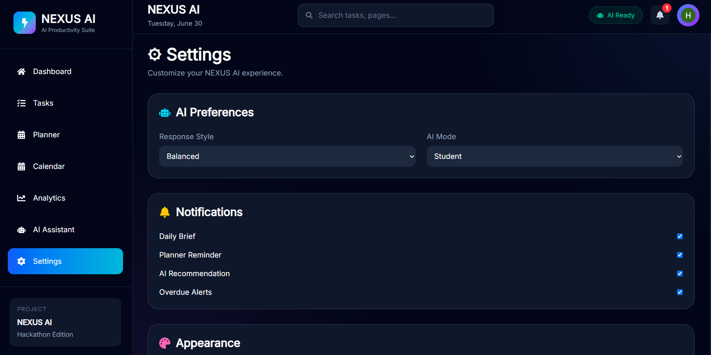

# 🚀 NEXUS AI

> AI-powered productivity companion with smart planning, analytics, reminders and Google authentication.

## ✨ Features

- 🔐 Google Authentication
- 🤖 AI Productivity Assistant
- 📋 Smart Task Management
- 📅 Calendar View
- 🧠 AI Planner
- 📊 Analytics Dashboard
- 🔔 Smart Reminder System
- 🌐 Browser Notifications
- 📥 Notification Center
- 🔍 Task Search
- ⚙️ User Settings

## 🛠️ Tech Stack

### Frontend
- React
- TypeScript
- Vite
- Tailwind CSS

### Backend
- FastAPI
- Python

### Database
- Supabase (PostgreSQL)

### AI
- Google Gemini
## 📸 Screenshots

### Dashboard


### Tasks


### Planner


### Analytics


### Calendar


### Notifications



## 📦 Installation

### Backend

```bash
cd backend
pip install -r requirements.txt
uvicorn app.main:app --reload
```

### Frontend

```bash
cd frontend
npm install
npm run dev
```

## 📁 Project Structure

```
backend/
frontend/
```

## 🎯 Future Improvements

- Mobile App
- Global Search
- Real-time Collaboration
- Push Notifications
- Offline Support

---

Built for the **Vibe2Ship Hackathon 2026**.
